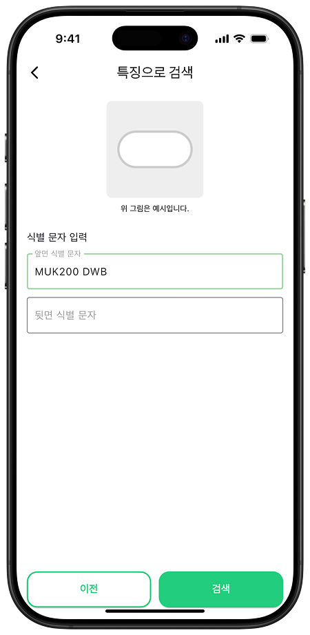

<h1 align="center">
  
  뭐약
</h1>


# 프로젝트 소개

> 알약 검색 및 병용 가능 여부 확인 어플리케이션

집에 남아 있는 약,  
혹시 비슷한 증상에 맞춰 다시 복용하고 계시진 않나요?

의약품을 임의로 복용하다 보면,  
함께 먹으면 안 되는 약을 동시에 복용하는 사고로 이어질 수 있습니다.

물론, 어떤 약을 복용해야 하는지는 전문가가 판단해야 할 영역입니다.  
하지만 함께 복용해선 안 되는 약에 대한 경고 정도는,  
누구나 소프트웨어를 통해 쉽게 확인할 수 있다면 좋지 않을까요?

그 물음에서 **뭐약**이 시작되었습니다.

약의 이름뿐 아니라 생김새만으로도  
무슨 약인지 쉽게 찾아볼 수 있고,  
복용 중인 약물 간의 병용 가능 여부도 확인할 수 있는  
모바일 애플리케이션, **뭐약**입니다.

---

## 기대 효과

- 약물 사고 예방을 통한 사회적 기여
- 고령자 및 만성질환자의 복약 부담 경감
- 공식적인 출처에서 신뢰할 수 있는 정보 제공

---

## 시연 영상

[](https://youtu.be/ua1vkYBRqfg)

---

## 주요 기능

### 홈 화면
<p>
  
</p>

### 제품명으로 약 검색
의약품의 정확한 제품명을 알고 있다면, 제품명을 통해 검색할 수 있습니다.
<p>
  
</p>

### 외형 정보 기반 검색
제품명을 모르더라도 알약의 형태, 색상, 제형, 분할선, 식별 문자를 통해 검색할 수 있습니다.<br>
검색 결과 중 일치하는 의약품을 나의 복용약에 추가합니다.
<p>
  
  
  
  
  
  
</p>

### 카메라 기반 검색
**해당 기능은 아직 작동하지 않습니다. 가까운 일 내 지원 예정입니다.**<br>
카메라 인식을 통해 외형 정보 입력을 대신할 수 있습니다.<br>
검색 결과 중 일치하는 의약품을 나의 복용약에 추가합니다.
<p>
  
  
</p>

### 나의 복용약 관리
나의 복용약들을 함께 복용해도 되는 지 확인할 수 있습니다.<br>
함께 복용할 수 없는 경우에는 그 이유와 함께 경고가 나타납니다.<br>
또한, 각 의약품의 효능, 용법, 주의사항 등 상세 정보를 확인할 수 있습니다.
<p>
  
  
  
</p>

---

## 아키텍처

<p align="center">
  
</p>

---

## 기술 스택

- **Frontend**: Flutter  
- **Backend**: Django (REST API)  
- **Database**: SQLite

---

## 환경 설정

### 1. 운영환경 개요
- 프레임워크: Django 5.1.7  
- 프로그램 언어: Python 3.11.9  
- 로컬 데이터베이스: SQLite  

### 2. 필수 설치 패키지

```bash
# Django 및 REST Framework 설치
pip install Django djangorestframework

# CORS 설정 패키지 설치
pip install django-cors-headers
```

### 3. settings.py 설정
- DB 설정
- CORS 설정
- 캐싱 설정

### 4. 외부 API 인증키 발급
- 공공데이터포털 OpenAPI 활용 신청 및 인증키 발급
- OpenAI API Key 발급

### 5. settings.dart 설정
- 서버 url 설정

---

## 팀원 소개

| 이름 | 학번 | 역할 | GitHub / 연락처 |
|------|----------|------|------------------|
| 김민철 | 20180485 | 팀장 / 프론트엔드 | [GitHub](https://github.com/Armont52) |
| 조원혁 | 20180519 | 백엔드 | [GitHub](https://github.com/5starss) |

---

## 기타

- 제작 기간: 2025.03 ~ 2025.06  
- 참고 자료: [공공데이터포털](https://www.data.go.kr/)
